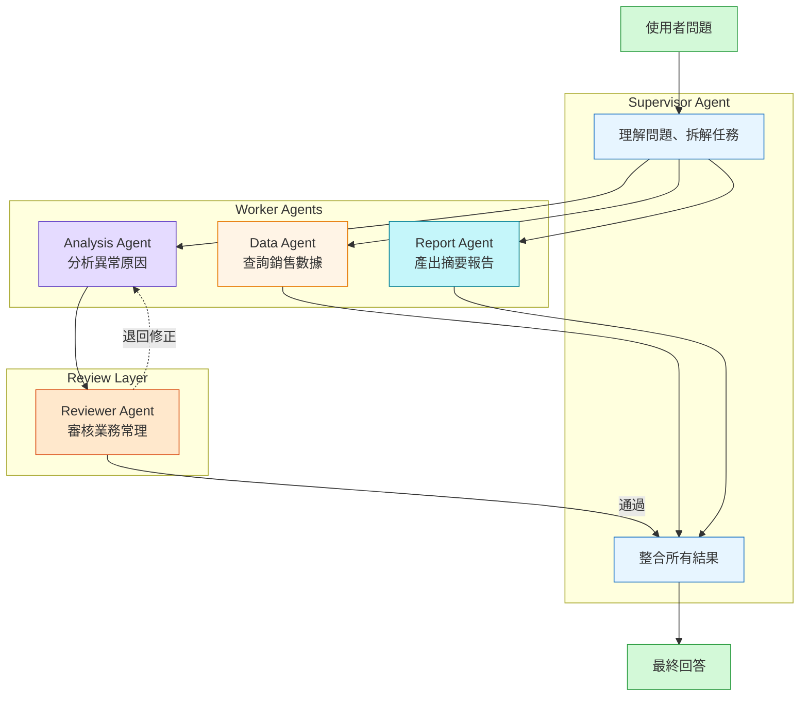
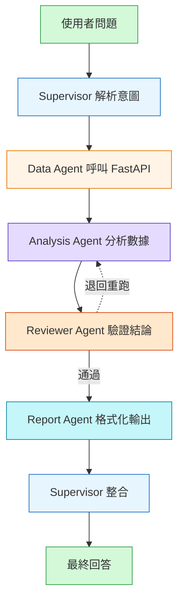

# Multi-Agent 架構設計文件

## 系統架構



## Agent 職責邊界

| Agent | 職責 | 工具 |
|-------|------|------|
| Supervisor | 理解問題、拆解任務、分配 Worker、整合結果 | 無（純推理） |
| Data Agent | 查詢銷售與廣告數據 | query_sales_data, query_ad_spend |
| Analysis Agent | 比對數據、找出異常原因 | （接收 Data Agent 輸出） |
| Reviewer Agent | 審核計算邏輯是否符合業務常理 | 無（純審核） |
| Report Agent | 格式化輸出結構化報告 | 無（純生成） |

## 設計決策

### 為什麼加 Reviewer Agent？

行銷數據有業務常理限制（ROAS 不可能為負數、銷售額不可能一天暴增 1000%）。在 Analysis Agent 輸出後加一道審核層，防止 LLM 幻覺導致誤導性結論。

Reviewer Agent 的審核規則範例：
- ROAS < 0 → 不合理，標記為幻覺
- 單日銷售成長 > 500% → 需要額外證據才能採信
- 退貨率 > 100% → 數字錯誤，拒絕輸出

### 為什麼用 LangGraph 而非單純的 LLM 呼叫？

LangGraph 把 Agent 的執行流程定義成**有向圖（DAG）**，好處：

1. **可視化流程**：每個節點（Agent）的輸入輸出明確，易於 debug
2. **條件分支**：Reviewer 審核不通過時可以路由回 Analysis Agent 重跑
3. **State 管理**：所有 Agent 共享同一個 State 物件，不需要手動傳遞資料

### 防禦性設計：safe_invoke

每個 LLM 呼叫都包在 `safe_invoke()` 裡，捕捉 API 錯誤並回傳預設值，避免單一 Agent 失敗導致整個流程崩潰：

```python
def safe_invoke(llm, messages, fallback="無法取得回答"):
    try:
        return llm.invoke(messages).content
    except Exception:
        return fallback
```

## 資料流



## 生產環境擴展方向

- 用 **RabbitMQ** 將 Agent 任務異步化，避免長任務阻塞
- 用 **Redis** 儲存 LangGraph State，支援水平擴展
- 加入 **POST /analyze** 端點，將 Multi-Agent 流程接進 FastAPI，提供統一的 HTTP 介面
